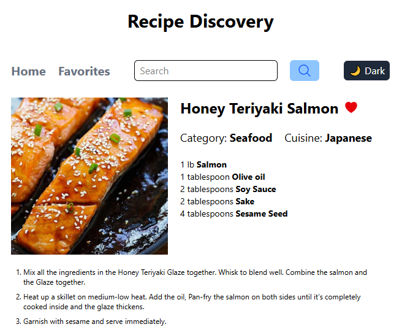

# Per Scholas - Module 10 - SBA – Recipe Discovery

This project is a client-side Recipe Discovery application. It allows users to browse recipes by category, search for specific recipes, view detailed recipe information, and manage a personal list of favorite recipes. The app uses the free, public TheMealDB
API for recipe data and implement a multiple hooks, state management patterns, and routing solutions to create a feature-rich, single-page application (SPA).

## Table of contents

- [Overview](#overview)
  - [The challenge](#the-challenge)
  - [Screenshot](#screenshot)
  - [Installation](#installation)
- [My process](#my-process)
  - [Built with](#built-with)
  - [What I learned](#what-i-learned)
  - [Continued development](#continued-development)
  - [Useful resources](#useful-resources)
- [Author](#author)
- [Acknowledgments](#acknowledgments)

## Overview

### The challenge

Users should be able to browse recipes by category, view recipe details including a picture, ingredient list and cooking instructions. Recipes can be marked as a favorite and all the favorites are shown on a custom favorites page. The recipe database can also be searched by keyword for direct access. The favorite list is saved in local storage, so that the user’s preferences are preserved across sessions.

### Screenshot

Sample recipe page showing Honey Teriyaki Salmon

### Installation

To run this application locally requires a few libraries, detailed in package.json. These include Vite, React Router, Tailwind, Hero Icons, and React Loader Spinner. You should be able to install them with 'npm i', but they can also be installed manually:

- npm i react-router-dom
- npm i tailwindcss @tailwindcss/vite
- npm i @heroicons/react
- npm i react-loader-spinner

  After setup, you can run the Vite instance on node.js with 'npm run dev'

## My process

### Built with

- React, TypeScript, and Tailwind
- React Router for pages with dynamic URLs
- custom hooks for favorites and dark/light themes
- Semantic HTML5 markup with accessibility and responsiveness
- CSS Grid and Flexbox
- JavaScript event handling and data manipulation
- Local storage

### What I learned

One of the challenges with this project was the typing for properties for the context providers, especially the helper functions. The most difficult part of the project turned out to be saving favorites in local storage, even though I had used it many times before. I thought it would be interesting to use a set in order to save the favorites, which was a fair challenge due to all the typing necessary. But then, after too much experimentation, I learned that JSON.stringify turns a set into an empty object. I was able to find a workaround that allowed a Set to be converted in order to save it into local storage. But then it was saved as an array, which would have required another hack to convert it back into a Set upon retrieval. So, instead I changed it all to use an array for favorites.

### Useful resources

- [HeroIcons](https://heroicons.com/) - Beautiful hand-crafted SVG icons, by the makers of Tailwind CSS. Available as basic SVG icons and via first-party React and Vue libraries.
- [Tailwind Dark Mode](https://tailwindcss.com/docs/dark-modes) - Tailwind includes a dark variant that lets you style your site differently when dark mode is enabled.

## Author

David Fiel

- Website - [David Fiel](https://fiel.us)

## Acknowledgments

Thanks to Per Scholas!
